# Inventory Inventor
Author: Joshuarox100

Description: Make inventories fast with Inventory Inventor! With it, you can create inventories with plenty of toggles, all managed by a single Expression Parameter! *(Disclamer: You can choose to use more parameters if you want to save the state of items in the Inventory.)*

Dependencies: 
- [BMB Libraries](https://github.com/Joshuarox100/BMB-Libraries) (Included)
- [VRCSDK3-AVATAR](https://vrchat.com/home/download) (Not Included)

## Installation Guide
Simply download and import the latest **Unity Package** from [**Releases**](https://github.com/Joshuarox100/VRC-Inventory-Inventor/releases) on GitHub **(You will have issues if you don't)**.
> **Do NOT download and try to use the source code on its own from the main page. It will not compile correctly unless you download BMB Libraries and you will also be missing other minor files.**

## How to Use
Before following these steps, set up your Avatar how you normally would and ensure that you have a basic understanding of how Avatars 3.0 works.

1) To create an Inventory, first create a Preset as described in [Creating a Preset](#creating-a-preset).

2) Then use the manager to apply your Preset as described in [Using the Manager](#using-the-manager).

If you would like to see an example of how an Inventory looks on an Avatar and within a Preset, there is an example Scene and Preset you can reference in the 'Example' folder. Additionally, if you have any issues or questions, look in the [troubleshooting](#troubleshooting) and [questions](#common-questions) sections below before [contacting me](#contacting-me).

## Creating a Preset
To add an Inventory to an Avatar, you first need to create a Preset!

To create a new Preset, right click the Asset browser and select 'Create -> Inventory Inventor -> Preset'.

  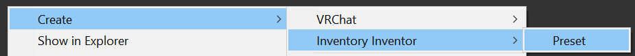

After you name the newly created Preset, you should see something similar to the below image.

  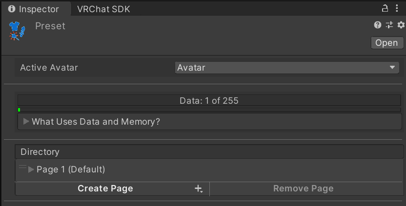

From here, it gets a lot more open ended. If you would like to jump to a particular topic, use the below links.

1. [Data & Memory](#data-&-memory)
2. [Pages](#pages)
3. [Items](#items)
4. [Groups](#groups)
5. [Tips](#tips)

### Data & Memory

  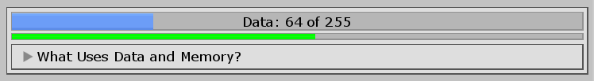

All Presets have a dynamic limit to how many [Items](#items) they can contain. This limit changes depending on the settings used for each [Item](#items). There are two limits you need to be aware of: the data limit (top bar), and the memory limit (bottom bar).

#### Data Limit
The Inventory only uses a single Integer for syncing changes and the current state of the Inventory. This means that the Inventory can only use up to 255 unique values to control everything. If your Preset needs more values than this, you won't be able to apply it to an Avatar. The way that data is used can be seen below.
	
- [Toggles](#toggle) with syncing set to Off will always use at least one value and another one for each Group it uses (1 - 3).
	
- [Toggles](#toggle) with syncing set to Manual will always use three values no matter what (3).
	
- [Toggles](#toggle) with syncing set to Auto will always use at least one value, another two if the value isn't set to save, and another one for each Group it uses (1 - 5).
	
- [Buttons](#button) will always use a single value (1).

#### Memory Limit
With the introduction of Parameter Persistence to VRChat, the restriction on the number of Expression Parameters was removed in favor of a limit on bits. Since an Inventory always requires at least one Integer, at least 8 bits will always be used. However, for Parameter Persistence to work with an Inventory, more bits must be used.

Each saved [Toggle](#toggle) in a Preset will require one bit of memory. In other words, you can have as many saved [Toggles](#toggle) as you have available memory on an Avatar up to a maximum of 120. If you exceed your Avatar's available memory, you will be unable to apply it to that Avatar and the bar's color will change to yellow.

### Pages

  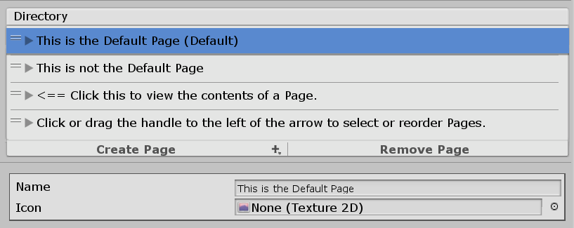

Pages are a Preset's equivalent of a Submenu (quite literally). All Pages can be given a custom name and icon. These will be used in the Expressions Menus for any controls that direct to other pages within the Preset.

If two Pages are given the same name, the most recently modified Page will be given an extension depending on its instance. For example: "Name", "Name 0", & "Name" would become "Name", "Name 0", & "Name 1" and so on.

All Pages can contain up to 8 different [Items](#items) used for toggling objects, accessing other Pages, or for accessing external menus.

#### Default
The first Page in the list will always become the Default. The Default Page functions exactly the same as a regular Page, except that it will always be the menu that the Inventory initially starts in when added to the Avatar. If a menu is provided in the manager when applying the Preset, this is the Page that will be added to it as a Submenu using the Page's name and icon. The Default Page will always be represented with the word 'Default' to the right of its name.

### Items

  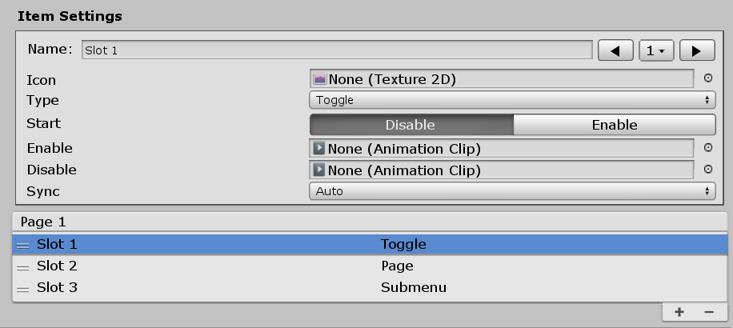

An Item represents a control contained within a [Page](#pages). An Item can be one of four types: a [Toggle](#toggle), a [Button](#button), a [Subpage](#subpage), or a [Control](#control). Each type of Item functions differently.

#### Toggle

  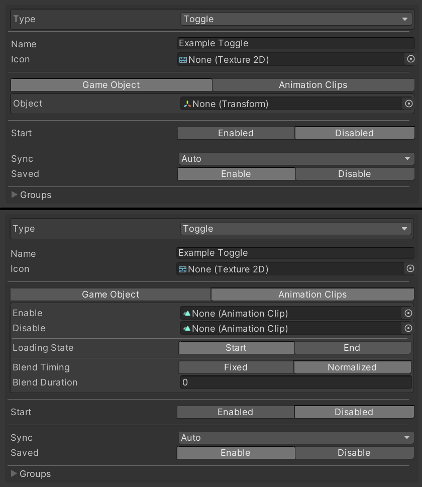

Toggles can be used to toggle between two Animations and can be configured in several different ways. Toggles can also use [Groups](#groups) for affecting other Toggles simultaneously. The function of each setting is listed below.

| Setting | Description |
| :----: | ------ |
| Name | The name that the Item's control will use in the Expressions Menu. |
| Icon | The icon that the Item's control will use in the Expressions Menu. |
| Start | The starting state of the Toggle. The corresponding Animation will play by default when the Avatar is loaded or reset. |
| Object | (When using Game Objects,) the Game Object the Toggle will affect. If the object saved cannot be found on the Active Avatar, no Animations will be created for this Toggle. |
| Enable | (When using Animation Clips,) the Animation to play when the Toggle is activated. |
| Disable | (When using Animation Clips,) the Animation to play when the Toggle is deactivated. |
| Sync | How the Toggle is synced with others. **Off**: Local only; remote clients will only see the default state of the Toggle. **Manual**: Syncs when triggered; late-joiners will see the default state until the Toggle is reused. **Auto**: Always synced; any Toggles marked Auto will be synced while the Inventory is left idle. |
| Saved | ***Only available with Auto Sync enabled.*** Whether or not to retain the item's active state when switching Avatars or worlds. *Each item with this setting enabled will take up one bit of memory in the Avatar's Expression Parameters list.* |

#### Button

  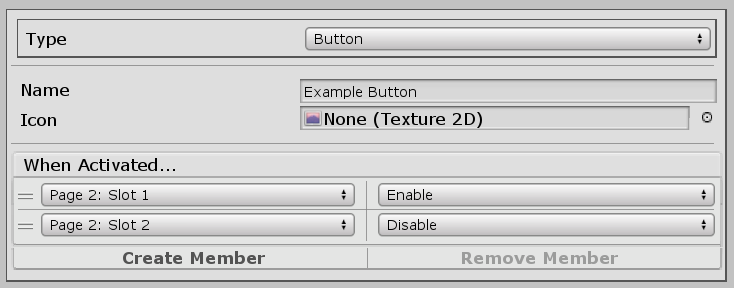

Button Items act like one-way [Groups](#groups). They can usually be used for switching to specific outfits quickly, and are more data-efficient than using [Groups](#groups) on [Toggles](#toggle). Buttons will set the state of items every time they are activated.

#### Subpage

  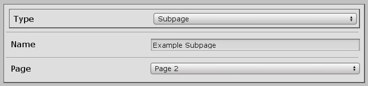

Subpages can be used to access any other [Page](#pages) in the Preset (excluding the one it's contained within). An Item using this type will automatically use the icon of the [Page](#pages) it directs to.

#### Control

  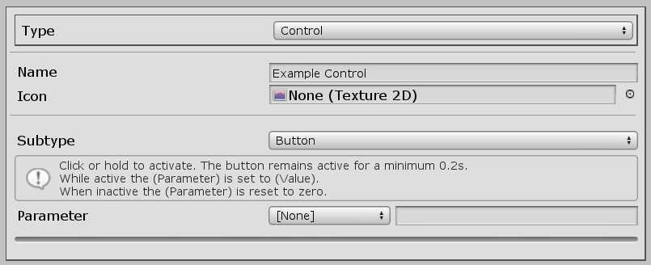

Control Items are regular controls that you would use in an actual Expressions Menu (Submenus, Puppets, etc.). It is used and configured exactly the same as you would in a Expressions Menu, which you can view the documentation for [here](https://docs.vrchat.com/docs/expression-menu-and-controls#types-of-controls).

### Groups

  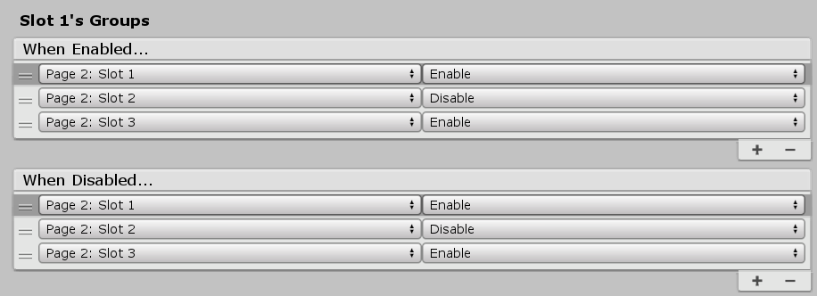

Groups are used for toggling multiple objects at once. Each Group can have as many members as there are [Toggles](#toggle) in the Preset. Groups can only be used with [Toggles](#toggle), and each [Toggle](#toggle) can trigger a different Group depending on if it is being enabled or disabled.

Every member contained within a Group can be either enabled or disabled upon the Group being activated. Only the Group on the toggled [Item](#items) will be triggered, any other Groups within its members will be ignored.

### Tips
Here are some things you should keep in mind as you create your Preset.

1. The Animations you use for [Toggles](#toggle) must be usable in the FX layer. If they're not compatible, you will receive an error when applying the Preset to an Avatar.

2. Any [Pages](#pages) that exist in the Preset but don't have a way to be accessed will still be created when the Preset is applied to an Avatar. You can then take the menus for these [Pages](#pages) and put them elsewhere on your Avatar if you wish.

3. If you want to trigger something else with a [Toggle](#toggle) that isn't part of the Preset, you can have an empty [Toggle](#toggle) and use its layer's values elsewhere.

4. Because of how ScripatbleObjects in Unity work, only the *relative path* to Game Objects can be stored. Thus, if you were to move an object a [Toggle](#toggle) was using from your right hand to your left, you will need to reassign that object to the [Toggle](#toggle).

## Using the Manager
The manager is used for both applying Presets and removing existing Inventories on an Avatar. It can be accessed under 'Tools -> Avatars 3.0 -> Inventory Inventor -> Manage Inventory'.

  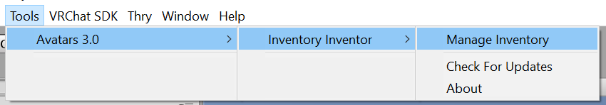

You can choose which of these operations you wish to perform by selecting it on the toolbar. The settings you're able to configure vary depending on the operation you've chosen.

### Create

  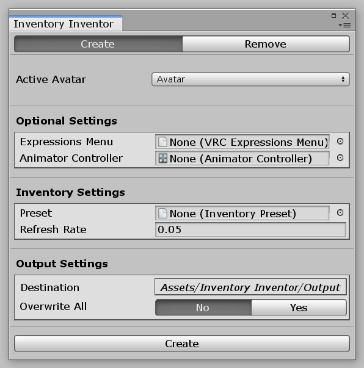

The 'Create' menu is used for creating an Inventory from a given Preset and applying it to an Avatar. If an Inventory already exists on the Avatar when a Preset is being applied, it will be replaced (excluding any parameters).

| Setting | Description |
| :----: | ------ |
| Active Avatar | The Avatar you want to manage an Inventory for. |
| Expressions Menu | The Expressions Menu you want to access the Inventory from. Leave this empty if you don't want any menus to be affected. (Will be added as a Submenu.) |
| Animator Controller | The Animator Controller to modify. (If left empty, a new Animator Controller will be created and used.) |
| Preset | The Preset you want to apply to the Avatar. |
| Refresh Rate | How long each synced toggle is given to synchronize with late joiners (seconds per item). |
| Destination | The folder where generated files will be saved to. |
| Overwrite All | Automatically overwrite existing files and parameters if needed. |

### Remove

  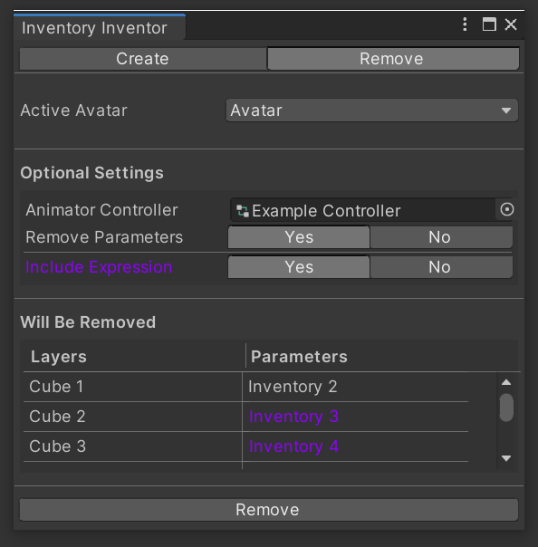

The 'Remove' menu is used for removing an existing Inventory from a provided Animator Controller.
>This will **NOT** remove or delete any menus or Expression Parameters from an Avatar by default.

Any layers or parameters that will be removed from the provided Controller during the operation will be shown under 'Will Be Removed'.

| Setting | Description |
| :----: | ------ |
| Active Avatar | The Avatar you want to manage an Inventory for. |
| Animator Controller | The Animator Controller to modify. |
| Remove Parameters | Remove all parameters involved with the Inventory (If you have other parameters named "Inventory ###", they will also be removed). |
| Expression Parameters? | (When using Remove Parameters,) also remove Expression Parameters related to the removed parameters if they exist. |

## Common Questions
**Can I have multiple Inventories on a single Avatar?**
>Not at the moment. I don't really plan or see the need for this feature, but if I see demand for it I will supply.

**Can I use the Inventory with other layers beside FX?**
>Although it isn't natively supported or done automatically, if you copy some layers around and use some empty [Toggles](#toggle) as placeholders you can make it work.

**Can this tool cause unrepairable damage to my Animator Controllers?**
>As far as I am aware, no. Before any files are modified, their raw data is stored and used to revert all affected files entirely if an error happens to occur.

## Troubleshooting
**My Inventory isn't syncing correctly to people joining late.**
>Your Refresh Rate may be too fast for the network to handle. Try reapplying your Preset using a slower time. Also make sure that your [Toggles](#toggle) are set to Auto Sync instead of Manual Sync.

**Items aren't being saved when I test the Inventory.**
>Parameters don't save for Avatars created with Build & Test. They must be uploaded in order to use it.

**VRChat has started crashing when switching away from an Avatar that has an Inventory on it!**
>This was due to an odd bug with v1.0.0 that I hadn't noticed during development. To fix it, make sure you are using version v1.0.1 or higher and reapply your preset.

**"An exception occured!"**
>If this happens, ensure you have a clean install of Inventory Inventor, and if the problem persists, [let me know](#contacting-me)!

## Contacting Me
If you still have some questions or recommendations you'd like to throw my way, you can ask me on Discord (Joshuarox100#5024) or leave a suggestion or issue on the [Issues](https://github.com/Joshuarox100/VRC-Inventory-Inventor/issues) page.
