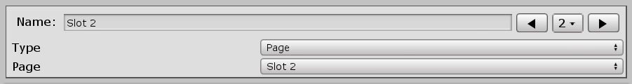
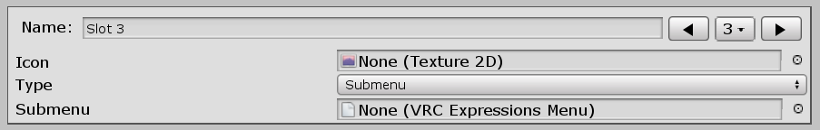

# Inventory Inventor

Author: Joshuarox100

Description: Make inventories fast with Inventory Inventor! With it, you can create inventories with up to 64 synced toggles, all contained within a single Expression Parameter!

Dependencies: 
- [BMB Libraries](https://github.com/Joshuarox100/BMB-Libraries) (Included)
- VRCSDK3-AVATAR (Not Included)

## Installation Guide
Simply download and import the latest **Unity Package** from [**Releases**](https://github.com/Joshuarox100/VRC-Inventory-Inventor/releases) on GitHub **(You will have issues if you don't)**.

  

## How to Use
1) To create an Inventory, first create an Inventory Preset as described in [Creating a Preset](#creating-a-preset).

  

2) To apply the preset to your Avatar, open the manager located under 'Tools -> Avatars 3.0 -> Inventory Inventor -> Manage Inventory'.

  

3) Configure the manager with your preset as described in [Using the Manager](#using-the-manager).

  

4) Finally, click Create to apply the preset to your Avatar! 

If you have any issues or questions, look in the [troubleshooting](#troubleshooting) and [questions](#common-questions) sections below before [contacting me](#contacting-me).

## Creating a Preset
To add an Inventory to an Avatar, you first need to create a Preset!

To create a new Preset, right click the Asset browser and select 'Create -> Inventory Inventor -> Preset'.

  

After you name the newly created Preset, you should see something similar to the below image.

  

From here, it gets a lot more open ended. If you would like to jump to a particular topic, use the below links.

1. [Pages](#pages)
2. [Items](#items)
3. [Groups](#groups)
4. [Hints](#hints)

### Pages

  

Pages are a Preset's equivalent of a Submenu (quite literally). All Pages can be given a custom name and icon. These will be used in the Expressions Menus for any controls that direct to other pages within the Preset.

If two Pages are given the same name, the most recently modified Page will be given an extension depending on its instance. For example: "Name", "Name 0", & "Name" would become "Name", "Name 0", & "Name 1" and so on.

#### Default
The first Page in the list will always become the Default. The Default Page functions exactly the same as a regular Page, except that it will always be the menu that the Inventory initially starts in when added to the Avatar. If a menu is provided in the manager when applying the Preset, this is the Page that will be added to it as a Submenu using the Page's name and icon. The Default Page will always be represented with the word 'Default' to the right of its name.

#### Regular
Every other Page aside from the first will be a regular Page. Regular Pages can contain up to 8 different [Items](#items) used for toggling objects, accessing other Pages, or for accessing external Menus.

### Items

  

An Item represents a control contained within a Page. An Item can be one of three types: a Toggle, a Page, or a Submenu. Each type of Item functions differently.

#### Toggle

  

Toggles can be used to toggle between two Animations and can be configured in several different ways. Toggles can also use [Groups](#groups) for toggling other Toggles simultaneously. The function of each setting is listed below.

| Setting | Description |
| :----- | ------ |
| Name | The name that the Item's control will use in the Expressions Menu. |
| Icon | The icon that the Item's control will use in the Expressions Menu. |
| Start | The starting state of the Toggle. The corresponding Animation will play by default when the Avatar is loaded or reset. |
| Enable | The Animation to play when the Toggle is activated. |
| Disable | The Animation to play when the Toggle is deactivated. |
| Sync | How the Toggle is synced with others.  Off: Local only; Remote clients will see the default state of the Toggle. Manual: Syncs when triggered; Late-joiners will see the default state until the Toggle is reused. Auto: Always synced; Any Toggles marked Auto will be synced while the Inventory is left idle. |

#### Page

  

Page Items can be used to access any other Pages in the inventory (excluding the one it's apart of). An Item using this type will automatically use both the name and icon of the Page it directs to.

#### Submenu

  

Submenu Items are used to access any Expressions Menus that are not a part of the Inventory. The name and icon given to a Submenu Item will be used for the Submenu control within the Page's Expressions Menu.

### Groups

  

Groups are used for toggling multiple objects at once. Each Group can have as many members as there are Toggles in the Preset. Groups can only be used with Toggles, and each Toggle can trigger a different Group depending on if it is being enabled or disabled.

Every member contained within a Group can be either enabled or disabled upon the Group being activated. Only the Group on the toggled Item will be triggered, any other Groups within its members will be ignored.

### Hints
Default

## Using the Manager
Default

## Common Questions
**Can I make submenus using the UI?**
>Not yet! That feature is planned for the future though.

**Can I have multiple inventories on a single avatar?**
>Let me answer your question with a another question: *Why do you need more than 64 toggles to begin with?*  
	Truthfully though, if you are seriously needing that much inventory space, perhaps you should consider splitting it up into multiple avatars for performance reasons alone or consider other ways to achieve what you're attempting to do. That said, once I do implement submenu creation in my UI, I will be raising the limit to 85 items to accomodate it.

**How do those who join the world late see me?**
>If you leave Auto Sync on, the current state of your inventory will be synced to them over a short period of time while the system is idle. If Auto Sync is left off, late-joiners will only see the initial state of the objects until you toggle them again, a bit like how toggles work in Avatars 2.0.

## Troubleshooting
**My Inventory isn't syncing correctly to people joining late.**
>Your Refresh Rate may be too fast for the network to handle. Try recreating your inventory using a slower time.

**The Debug menu is just showing random numbers for each of the item layers.**
>This is a visual bug caused by having State Machines named differently than their originating Layer. This doesn't actually cause any problems remotely or locally so you don't need to worry about it too much. A bug report for it exists on the Feedback forum if you want to upvote it [here](https://feedback.vrchat.com/avatar-30/p/bug-debug-menu-fails-to-show-state-names-when-the-state-machine-is-named-differe).

**"An exception occured!"**
>If this happens, ensure you have a clean install of Inventory Inventor, and if the problem persists, [let me know](#contacting-me)!

## Contacting Me
If you still have some questions or recommendations you'd like to throw my way, you can ask me on Discord (Joshuarox100#5024) or leave a suggestion or issue on the [GitHub](https://github.com/Joshuarox100/VRC-Inventory-Inventor/issues) page.
